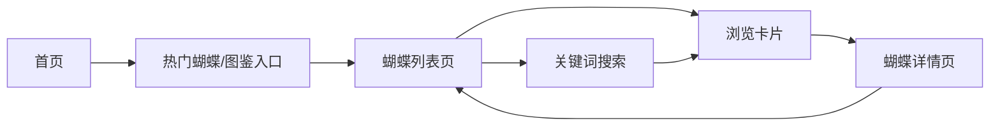

## 1. 产品概述

蝶语 Butterfly Whispers — 以蝴蝶为主题的自然科普学习平台，面向热爱自然、昆虫爱好者及学生群体。用户可浏览蝴蝶图鉴、学习分类知识、探索自然之美。

## 2. 核心功能

### 2.1 用户角色

| 角色 | 注册方式 | 核心权限 |
|------|----------|----------|
| 访客用户 | 无需注册 | 浏览蝴蝶图鉴、搜索、查看详情 |

### 2.2 功能模块

1. **首页**：导航栏、Hero 区域、热门蝴蝶展示、随机推荐蝴蝶
2. **蝴蝶列表页**：蝴蝶卡片网格、关键词搜索、分类筛选
3. **蝴蝶详情页**：高清大图、基础信息、分类、详细介绍

### 2.3 页面详情

| 页面名称 | 模块名称 | 功能描述 |
|----------|----------|----------|
| 首页 | 导航栏 | Logo、搜索框、导航链接（首页、蝴蝶图鉴） |
| 首页 | Hero 区域 | 主标题、副标题、背景图、引导按钮 |
| 首页 | 热门蝴蝶 | 横向滚动展示热度最高的 8 种蝴蝶卡片 |
| 首页 | 随机推荐 | 展示随机 6 种蝴蝶 |
| 蝴蝶列表页 | 搜索栏 | 关键词搜索（名称、分类、介绍） |
| 蝴蝶列表页 | 蝴蝶网格 | 响应式卡片网格，点击跳转详情页 |
| 蝴蝶详情页 | 大图展示 | 高清蝴蝶图片，hover 放大效果 |
| 蝴蝶详情页 | 信息面板 | 名称、拉丁名、分类、分布、特征介绍 |

## 3. 核心流程

用户进入首页 → 浏览热门蝴蝶或点击「蝴蝶图鉴」→ 在列表页搜索或浏览 → 点击蝴蝶卡片 → 进入详情页学习知识。

## 4. 用户界面设计

### 4.1 设计风格

- **主色**：蝶粉 #E8B4D4（柔和粉紫）、叶绿 #86B98E（自然绿）
- **辅色**：奶油白 #FFF9F5、墨色 #3A3A3A
- **按钮**：圆角胶囊形按钮，hover 微弹动效
- **字体**：标题使用 Cormorant Garamond（优雅衬线），正文使用 Noto Sans SC
- **布局**：卡片式布局，大量留白，柔和阴影
- **图标**：lucide-react，线性轻盈风格

### 4.2 页面设计概览

| 页面名称 | 模块名称 | UI 元素 |
|----------|----------|----------|
| 首页 | Hero 区域 | 渐变背景 + 蝴蝶剪影装饰，淡入动画 |
| 首页 | 热门蝴蝶 | 卡片悬浮上移动画，hover 光晕效果 |
| 蝴蝶列表页 | 搜索栏 | 聚焦放大动画，圆角搜索框 |
| 蝴蝶详情页 | 大图展示 | 图片渐显，侧边信息面板 |

### 4.3 响应式

桌面优先设计，移动端自适应，卡片网格在小屏折叠为单列，导航栏移动端折叠为汉堡菜单。
