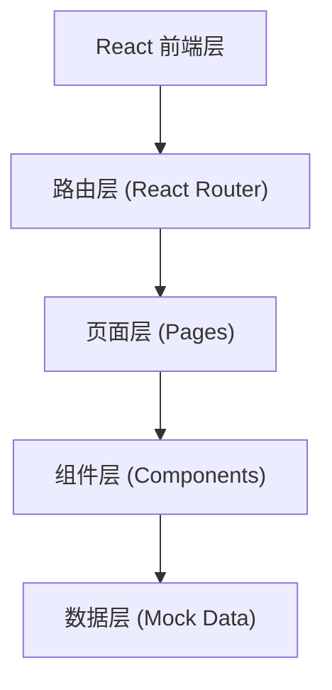

## 1. 架构设计



## 2. 技术说明

- **前端**：React@18 + TypeScript + Vite
- **样式**：Tailwind CSS@3
- **路由**：React Router DOM
- **状态管理**：Zustand（轻量状态）
- **图标**：lucide-react
- **后端**：无后端，使用 Mock 数据
- **初始化工具**：vite-init

## 3. 路由定义

| 路由 | 用途 |
|------|------|
| / | 首页：热门蝴蝶 + 随机推荐 |
| /butterflies | 蝴蝶列表页（搜索） |
| /butterfly/:id | 蝴蝶详情页 |

## 4. 数据模型

### 4.1 蝴蝶数据模型

```typescript
interface Butterfly {
  id: string;
  name: string;           // 中文名
  latinName: string;      // 拉丁学名
  family: string;       // 科
  genus: string;        // 属
  category: string;     // 分类（凤蝶/粉蝶/蛱蝶等）
  image: string;         // 图片 URL
  description: string;     // 基础介绍
  distribution: string;  // 分布地区
  wingspan: string;     // 翅展
  habitat: string;       // 栖息环境
  features: string[];    // 特征
  popularity: number;    // 热度（0-100
}
```

### 4.2 Mock 数据

预置 20+ 种真实蝴蝶种类数据，覆盖凤蝶科、粉蝶科、蛱蝶科、灰蝶科等主要科属分类。
