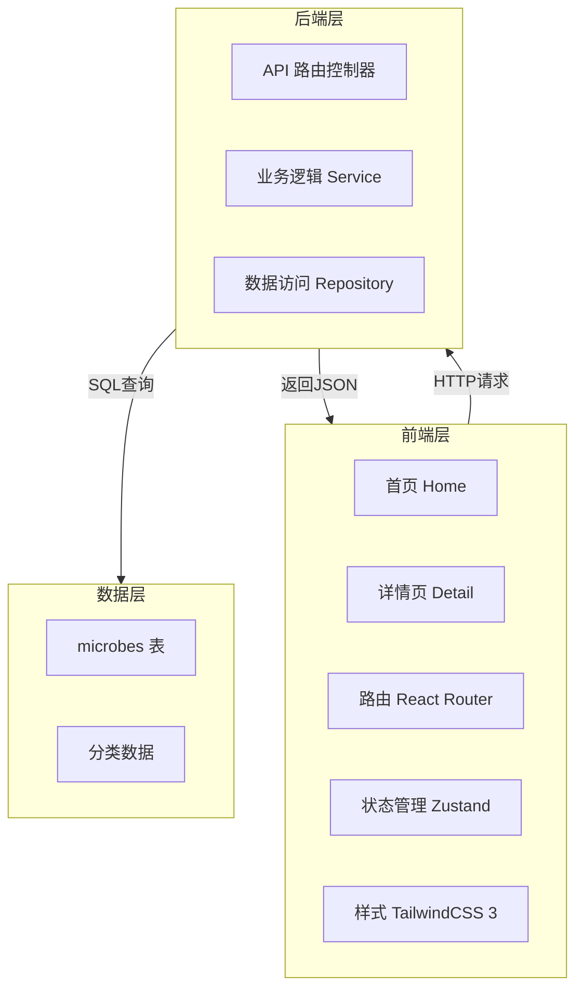
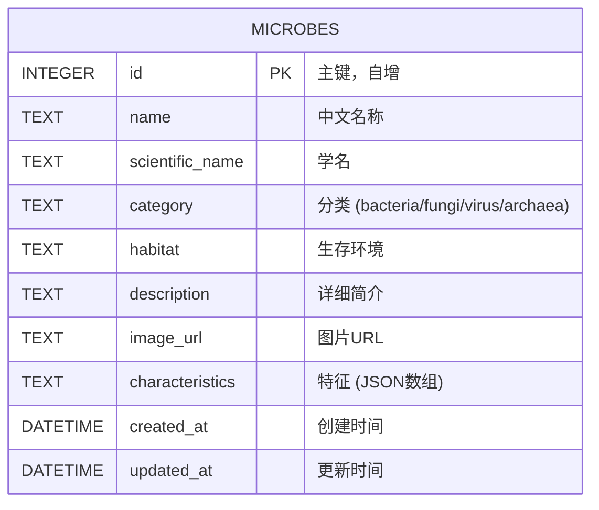

## 1. 架构设计



## 2. 技术描述

- **前端**：React 18 + TypeScript + Vite + TailwindCSS 3 + Zustand + React Router DOM
- **后端**：Express 4 + TypeScript + better-sqlite3
- **数据库**：SQLite（文件型，无需额外服务）
- **初始化工具**：使用 `react-express-ts` 模板

## 3. 路由定义

| 路由 | 页面 | 说明 |
|------|------|------|
| `/` | 首页 | 微生物列表、搜索、分类筛选 |
| `/microbe/:id` | 详情页 | 单个微生物详细信息 |
| `/api/microbes` | API | 获取微生物列表（支持搜索和分类筛选） |
| `/api/microbes/:id` | API | 获取单个微生物详情 |

## 4. API 定义

### 类型定义

```typescript
// 微生物分类
type Category = 'bacteria' | 'fungi' | 'virus' | 'archaea';

// 微生物实体
interface Microbe {
  id: number;
  name: string;
  scientificName: string;
  category: Category;
  habitat: string;
  description: string;
  imageUrl: string;
  characteristics: string[];
}

// 列表查询参数
interface MicrobeQuery {
  category?: Category;
  search?: string;
}

// API 响应
interface ApiResponse<T> {
  success: boolean;
  data: T;
  message?: string;
}
```

### 接口说明

**GET /api/microbes**
- 请求参数：`category`（可选）、`search`（可选）
- 成功响应：`ApiResponse<Microbe[]>`

**GET /api/microbes/:id**
- 请求参数：`id`（路径参数）
- 成功响应：`ApiResponse<Microbe>`
- 失败响应：`{ success: false, message: "微生物不存在" }`

## 5. 服务器架构图


## 6. 数据模型

### 6.1 ER图



### 6.2 DDL 语句

```sql
CREATE TABLE IF NOT EXISTS microbes (
  id INTEGER PRIMARY KEY AUTOINCREMENT,
  name TEXT NOT NULL,
  scientific_name TEXT NOT NULL,
  category TEXT NOT NULL CHECK (category IN ('bacteria', 'fungi', 'virus', 'archaea')),
  habitat TEXT NOT NULL,
  description TEXT NOT NULL,
  image_url TEXT NOT NULL,
  characteristics TEXT NOT NULL,
  created_at DATETIME DEFAULT CURRENT_TIMESTAMP,
  updated_at DATETIME DEFAULT CURRENT_TIMESTAMP
);

CREATE INDEX IF NOT EXISTS idx_microbes_category ON microbes(category);
CREATE INDEX IF NOT EXISTS idx_microbes_name ON microbes(name);
```

### 6.3 初始数据

预置20条微生物数据，每个分类5条：
- **细菌**：大肠杆菌、乳酸菌、金黄色葡萄球菌、幽门螺杆菌、硝化细菌
- **真菌**：酵母菌、青霉菌、蘑菇、冬虫夏草、黑曲霉
- **病毒**：噬菌体、新冠病毒、流感病毒、烟草花叶病毒、HIV
- **古菌**：嗜热菌、嗜盐菌、产甲烷菌、嗜酸菌、嗜冷菌
