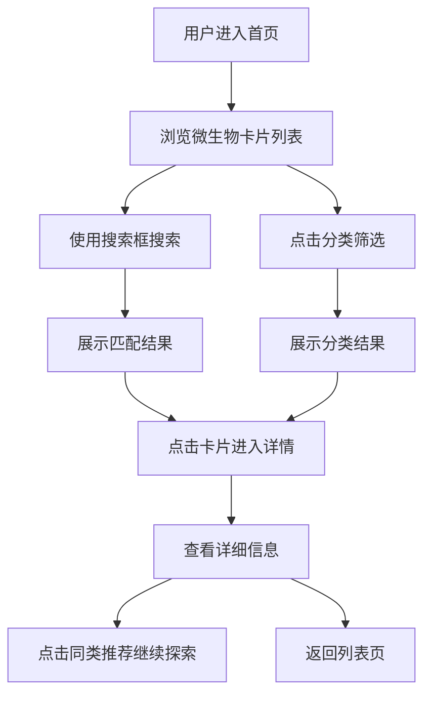

## 1. 产品概述

「微生物的文明」是一个微生物科普Web应用，带领用户探索微观世界中的生命文明。用户可以浏览细菌、真菌、病毒、古菌四大类微生物，了解它们的名称、分类、生存环境和独特之处。应用通过沉浸式的"微观宇宙"视觉设计，让科学知识变得生动有趣。

- 目标用户：学生、科普爱好者、对微观世界好奇的大众
- 产品价值：将枯燥的微生物知识转化为沉浸式探索体验

## 2. 核心功能

### 2.1 用户角色

| 角色 | 注册方式 | 核心权限 |
|------|----------|----------|
| 访客 | 无需注册 | 浏览微生物列表、搜索筛选、查看详情 |

### 2.2 功能模块

1. **首页**：Hero展示区、分类筛选器、搜索框、微生物卡片瀑布流
2. **详情页**：微生物大图、详细信息、同类推荐
3. **分类导航**：细菌、真菌、病毒、古菌四大分类切换

### 2.3 页面详情

| 页面名称 | 模块名称 | 功能描述 |
|----------|----------|----------|
| 首页 | Hero区域 | 项目标题、副标题、动态背景粒子效果 |
| 首页 | 搜索栏 | 关键词实时搜索微生物名称和简介 |
| 首页 | 分类筛选 | 四大分类标签切换，点击筛选对应微生物 |
| 首页 | 卡片列表 | 响应式瀑布流，展示微生物图片、名称、分类标签 |
| 详情页 | 大图展示 | 微生物高清图片，带显微镜边框效果 |
| 详情页 | 信息面板 | 名称、分类、生存环境、详细简介 |
| 详情页 | 同类推荐 | 展示相同分类的其他微生物 |

## 3. 核心流程

## 4. 用户界面设计

### 4.1 设计风格

**整体基调**：微观宇宙 · 科学博物 · 深邃神秘

- **主色调**：深邃靛蓝 `#0F172A`（背景）、生物荧光绿 `#4ADE80`（主强调）
- **分类色**：
  - 细菌：珊瑚粉 `#F87171`
  - 真菌：琥珀金 `#FBBF24`
  - 病毒：霓虹紫 `#A78BFA`
  - 古菌：冰蓝 `#22D3EE`
- **字体**：标题 Cormorant Garamond（衬线，学术感）、正文 Fraunces
- **卡片风格**：圆角16px，微妙光晕边框，悬浮时轻微上浮+旋转
- **动效**：背景粒子漂浮、卡片入场错峰动画、搜索框聚焦发光

### 4.2 页面设计概览

| 页面名称 | 模块名称 | UI元素 |
|----------|----------|--------|
| 首页 | Hero区域 | 大标题居中，副标题渐显，背景深色渐变+漂浮粒子 |
| 首页 | 搜索栏 | 圆角输入框，聚焦时边框发光，placeholder文字优雅 |
| 首页 | 分类筛选 | 四个胶囊按钮，选中时有对应分类色的光晕 |
| 首页 | 卡片列表 | 3列网格，卡片错落有致，hover时轻微上浮+发光 |
| 详情页 | 大图展示 | 圆形/圆角大图，带显微镜目镜边框效果 |
| 详情页 | 信息面板 | 分类标签色块，标题优雅衬线，正文行距舒适 |
| 详情页 | 同类推荐 | 横向滚动小卡片，点击跳转 |

### 4.3 响应式设计

- **桌面优先**：3列卡片网格，侧边分类筛选
- **平板**：2列网格，筛选器顶部排列
- **手机**：1列网格，筛选器可横向滚动

### 4.4 独特设计细节

1. **微生物形状语言**：不同分类卡片有不同边角特征——细菌圆润、真菌多角、病毒几何、古菌不规则
2. **显微镜视野**：详情页图片有显微镜目镜的视觉效果，带刻度和反光
3. **粒子背景**：首页背景有缓慢漂浮的微小粒子，模拟微生物游动
4. **卡片光晕**：hover时卡片边缘发出对应分类色的柔光
